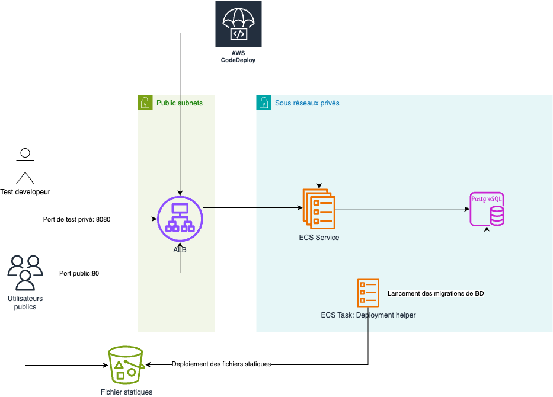
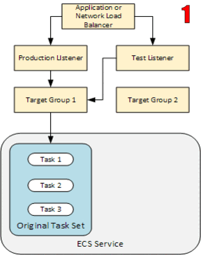

# Déployer en toute sérenité avec AWS CodeDeploy

Projet utilisé comme démo pour [La Journée du Cloud 2024.](https://www.linkedin.com/showcase/la-journ-e-du-cloud/about/)
Il s'agit d'une conférence Cloud qui rassemble les passionné(e)s et expert(e)s du continent africain pour partager leurs
expériences et leurs connaissances sur les technologies Cloud.

<p align="center">

</p>

## Contexte

Le but de cette présentation est de montrer comment déployer une application web sur AWS en toute sérénité en utilisant
AWS CodeDeploy et ses fonctionnalités de
déploiement [blue/green et canary](https://docs.aws.amazon.com/AmazonECS/latest/developerguide/deployment-type-bluegreen.html)

La présentation est disponible
sur [ce lien](https://docs.google.com/presentation/d/1zKD6mPMwTGq2qGTxcDj3IGAZtfPwN2DU7ooNSA23sy0/edit?usp=sharing)

## Architecture

L'architecture de l'application est la suivante:

- Une application web en Python et Django est déployée sur ECS Fargate. L'application est accessible via un Load
  Balancer public. Il s'agit d'une application avec un seul endpoint `/` un message et la version de l'application.
  L'interface d'administration de Django reste accessible via le chemin `/admin`.
- Une base de données RDS PostgreSQL est utilisée pour stocker les données
- Un bucket S3 est utilisé pour stocker les fichiers statiques de l'application



## Structure du projet

Se référer à la documentation de chaque dossier pour plus de détails.

- [app/](app): Contient le code source de l'application web. Une image Docker est construite à partir de ce code et
  disponible sur DockerHub: [elmhaidara/demo-ljdc](https://hub.docker.com/r/elmhaidara/demo-ljdc). Deux versions
  de l'image sont disponibles: `1.0.0` et `2.0.0`. Un bug a été introduit dans la version `2.0.0` qui renvoie une erreur
  500 avec 80% de chance lorsqu'on accède à `/`.
- [infra/](infra): Contient les fichiers Terraform pour déployer l'infrastructure.

## Stratégies de déploiement

Deux stratégies de déploiement sont exposées dans la présentation:

- *Blue/Green*: Déploiement d'une nouvelle version de l'application en parallèle de l'ancienne version.
  Le trafic est basculé en une seule opération de l'ancienne version vers la nouvelle version une fois que la nouvelle
  version est prête.
   ```mermaid
    graph TD
        A["Début"] --> AA["État Actuel: environnement Bleu Actif"]
        AA --> B["Déployer dans l'environnement Vert"]
        B --> C["Tester l'environnement Vert"]
        C --> D{"Tests Réussis ?"}
        D -- Oui --> E["Routage du Trafic vers l'environnement Vert"]  
        D -- Non --> Z["On arrête le déploiement"]
        Z --> F
        F --> B
        E --> G["Surveiller l'environnement Vert"]
        G --> H{"Tout va bien ?"}
        H -- Oui --> I["Arrêter l'environnement Bleu"]
        H -- Non --> X["On arrête le déploiement"]
        X --> J["Re-routage du traffic vers l'environnement Bleu (rollback)"]
        J --> F["Corriger les problèmes dans l'environnement Vert"]
        I --> L["Fin"]
        
        style A fill:black,color:white,stroke:none
        style AA fill:blue,color:white,stroke:none
        style B fill:green,color:white,stroke:none
        style C fill:green,color:white,stroke:none
        style D fill:#FFE0B2,color:black,stroke:none
        style E fill:green,color:white,stroke:none
        style F fill:green,color:white,stroke:none
        style G fill:green,color:white,stroke:none
        style H fill:#FFE0B2,color:black,stroke:none
        style I fill:blue,color:white,stroke:none
        style J fill:blue,color:white,stroke:none
        style L fill:black,color:white,stroke:none
        style X fill:red,color:white,stroke:none
        style Z fill:red,color:white,stroke:none
  ```
    - *Canary*: Déploiement progressif de la nouvelle version de l'application en redirigeant une petite partie du
      trafic
      vers la nouvelle version. Si tout se passe bien, le reste du trafic est redirigé vers la nouvelle version.
      ```mermaid
        graph TD
          A[Début] --> AA[Application en cours d'exécution]
          AA --> B[Déployer dans l'environnement Canary]
          B --> C[Tester l'environnement Canary]
          C --> D{Tests réussis ?}
          D -- Oui --> E[Déployer pour petit un groupe d'utilisateurs]
          D -- Non --> F[Corriger les problèmes dans l'environnement Canary]
          F --> B
          E --> G[Surveiller le déploiement Canary]
          G --> H{Tout va bien ?}
          H -- Oui --> I[Augmenter la taille du groupe d'utilisateurs]
          H -- Non --> J[Retourner à la version précédente]
          J --> F
          I --> L{Déploiement complet ?}
          L -- Oui --> N[Fin]
          L -- Non --> G
        
          style A fill:black,color:white,stroke:none
          style AA fill:yellow,color:black,stroke:none
          style B fill:#8BC34A,color:black,stroke:none
          style C fill:#CDDC39,color:black,stroke:none
          style D fill:#FFE0B2,color:black,stroke:none
          style E fill:#00BCD4,color:white,stroke:none
          style F fill:#F44336,color:white,stroke:none
          style G fill:#03A9F4,color:white,stroke:none
          style H fill:#FFE0B2,color:black,stroke:none
          style I fill:#00BCD4,color:white,stroke:none
          style J fill:#F44336,color:white,stroke:none
          style L fill:#FFE0B2,color:black,stroke:none
          style N fill:black,color:white,stroke:none
      ```

Ici, **on ne duplique pas la base de données.** Une attention toute particulière doit être donnée
lors de migration de données: le schéma de données doit être backward compatible. L'ancienne version de l'application
doit fonctionner avec les modifications de schéma effectuées par la nouvelle version. On essayera donc de déployer par
petit bout les modifications de schémas pour garantir cette compatibilité.

## AWS Code Deploy

AWS CodeDeploy permet de faire un mélange des deux approches précédentes en configurant les *traffic
shifts* via les configurations de déploiement. La présentation met le focus une stratégie canary avec une augmentation
graduelle du traffic sur la nouvelle version.

Le service ECS dispose de deux target groupes qui sont gérés par CodeDeploy: un pour blue et un pour green. Lors du
déploiement d'une nouvelle version, les nouvelles tâches ECS sont rattachées au target groupe qui n'est pas utilisé.

Un listener optionnel est rajouté au load balancer pour effectuer des tests avant de commencer le traffic shift.
L'approche est d'utiliser un port different (du port principal) qui n'est généralement pas accessible au public en
utilisant des security groups.

<p align="center">

</p>

